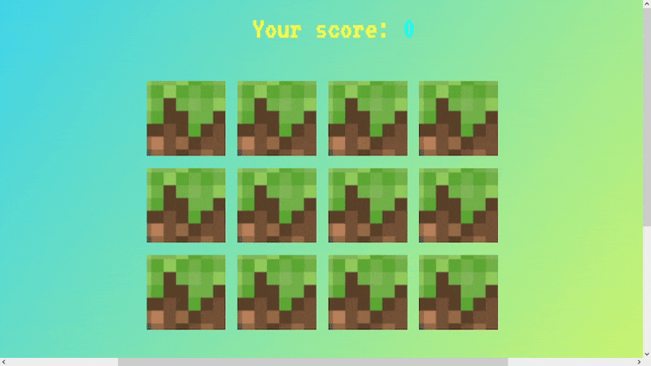

# 🧠 Memory Game

🎀 A card-matching memory game with simple animations and rich logic. 
🎨 Designed with a pixel-art vibe from fonts to sounds for that 🕹 nostalgic retro game feel ✨.
 
👩🏽‍💻 Great for brain training and JavaScript practice!✨

---

## 🎮 Features

- 🃏 Flip cards to find matching pairs
- Animated popUps 🌌
- Game logic includes:
  - Functions and arrays
  - `setTimeout`
  - `forEach` and `sort`
  - Event listeners
  - Object-based logic

---

## 📷 Preview 

---

## 🔊 Sound Effects

💥 Includes sounds for card flips and match results.

---

## 🛠 Tech Stack

- HTML
- CSS (with animations)
- JavaScript (174+ lines)
