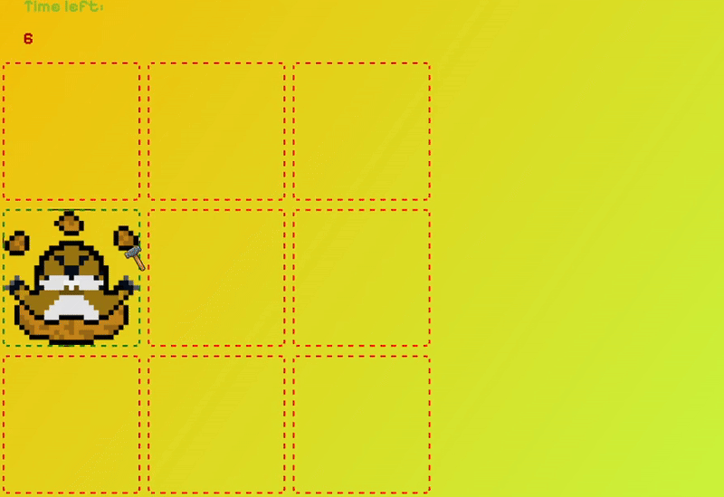

# 🐹 Whack-a-Mole

🎀 A simple,⚡fast-paced whack-a-mole game 👀 hit as many moles as you can before time runs out! 

---

## 🎮 Features

- Random mole pop-ups
- Interval-based gameplay
- Core logic includes:
  - Functions and timers
  - Object management
  - DOM manipulation

---

# 📷 Preview

---

## 🔊 Sound Effects

Mole hit and game-over sounds included.

---

## 🛠 Tech Stack

- HTML
- CSS
- JavaScript
